# ==git报错==

fatal: unable to access 'https://github.com/du-mozzie/GymManagementSystem.git/': OpenSSL SSL_read: Connection was reset, errno 10054

解决办法：

```
解除ssl验证后，再次git即可

git config --global http.sslVerify "false"
```


Failed to connect to github.com port 443:connection timed out

解决办法：

```bash
取消全局代理：
git config --global --unset http.proxy
 
git config --global --unset https.proxy
```
# 版本控制

## 什么是版本控制

版本控制（Revision control）是一种在开发的过程中用于管理我们对文件、目录或工程等内容的修改历史，方便查看更改历史记录，备份以便恢复以前的版本的软件工程技术。

-   实现跨区域多人协同开发
-   追踪和记载一个或者多个文件的历史记录
-   组织和保护你的源代码和文档
-   统计工作量
-   并行开发、提高开发效率
-   跟踪记录整个软件的开发过程
-   减轻开发人员的负担，节省时间，同时降低人为错误

简单说就是用于管理多人协同开发项目的技术。

没有进行版本控制或者版本控制本身缺乏正确的流程管理，在软件开发过程中将会引入很多问题，如软件代码的一致性、软件内容的冗余、软件过程的事物性、软件开发过程中的并发性、软件源代码的安全性，以及软件的整合等问题。

无论是工作还是学习，或者是自己做笔记，都经历过这样一个阶段！我们就迫切需要一个版本控制工具！

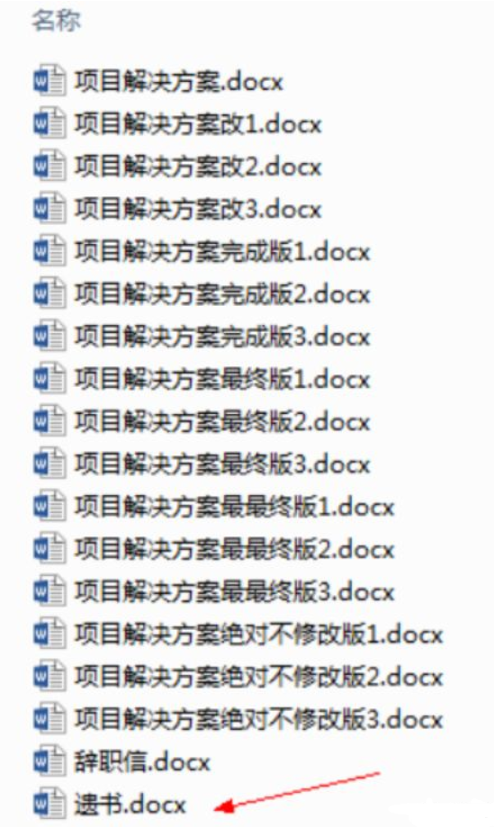

多人开发就必须要使用版本控制！

## 常见的版本控制工具

我们学习的东西，一定是当下最流行的！

主流的版本控制器有如下这些：

-   **Git**
-   **SVN**（Subversion）
-   **CVS**（Concurrent Versions System）
-   **VSS**（Micorosoft Visual SourceSafe）
-   **TFS**（Team Foundation Server）
-   Visual Studio Online

版本控制产品非常的多（Perforce、Rational ClearCase、RCS（GNU Revision Control System）、Serena Dimention、SVK、BitKeeper、Monotone、Bazaar、Mercurial、SourceGear Vault），现在影响力最大且使用最广泛的是Git与SVN

## 版本控制分类

**1、本地版本控制**

记录文件每次的更新，可以对每个版本做一个快照，或是记录补丁文件，适合个人用，如RCS。

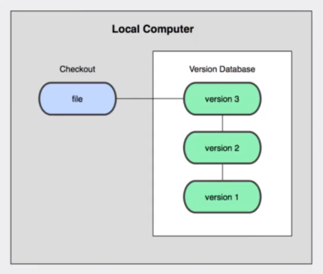

**2、集中版本控制  SVN**

所有的版本数据都保存在服务器上，协同开发者从服务器上同步更新或上传自己的修改

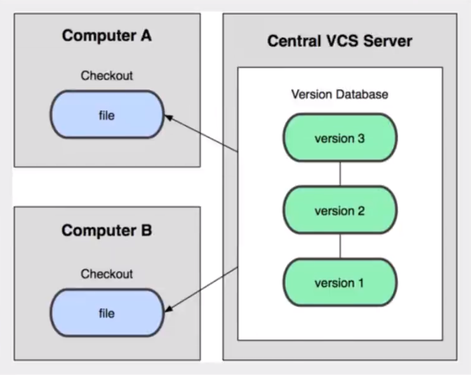

所有的版本数据都存在服务器上，用户的本地只有自己以前所同步的版本，如果不连网的话，用户就看不到历史版本，也无法切换版本验证问题，或在不同分支工作。而且，所有数据都保存在单一的服务器上，有很大的风险这个服务器会损坏，这样就会丢失所有的数据，当然可以定期备份。代表产品：SVN、CVS、VSS

**3、分布式版本控制 	Git**

每个人都拥有全部的代码！安全隐患！

所有版本信息仓库全部同步到本地的每个用户，这样就可以在本地查看所有版本历史，可以离线在本地提交，只需在连网时push到相应的服务器或其他用户那里。由于每个用户那里保存的都是所有的版本数据，只要有一个用户的设备没有问题就可以恢复所有的数据，但这增加了本地存储空间的占用。

不会因为服务器损坏或者网络问题，造成不能工作的情况！

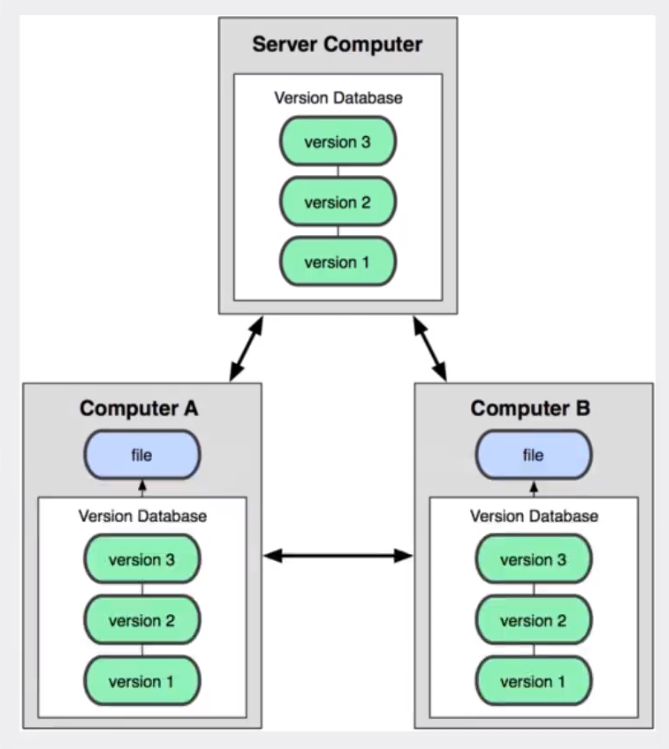

## Git与SVN的主要区别

SVN是集中式版本控制系统，版本库是集中放在中央服务器的，而工作的时候，用的都是自己的电脑，所以首先要从中央服务器得到最新的版本，然后工作，完成工作后，需要把自己做完的活推送到中央服务器。集中式版本控制系统是必须联网才能工作，对网络带宽要求较高。


Git是分布式版本控制系统，没有中央服务器，每个人的电脑就是一个完整的版本库，工作的时候不需要联网了，因为版本都在自己电脑上。协同的方法是这样的：比如说自己在电脑上改了文件A，其他人也在电脑上改了文件A，这时，你们两之间只需把各自的修改推送给对方，就可以互相看到对方的修改了。Git可以直接看到更新了哪些代码和文件！

==Git是目前世界上最先进的分布式版本控制系统。==

# Git的历史

同生活中的许多伟大事物一样，Git 诞生于一个极富纷争大举创新的年代。

Linux 内核开源项目有着为数众广的参与者。绝大多数的 Linux 内核维护工作都花在了提交补丁和保存归档的繁琐事务上(1991－2002年间)。到 2002 年，整个项目组开始启用一个专有的分布式版本控制系统 BitKeeper 来管理和维护代码。

Linux社区中存在很多的大佬！破解研究 BitKeeper ！

到了 2005 年，开发 BitKeeper 的商业公司同 Linux 内核开源社区的合作关系结束，他们收回了 Linux 内核社区免费使用 BitKeeper 的权力。这就迫使 Linux 开源社区(特别是 Linux 的缔造者 Linus Torvalds)基于使用 BitKeeper 时的经验教训，开发出自己的版本系统。（2周左右！） 也就是后来的 Git！

Git是免费、开源的，最初Git是为辅助 Linux 内核开发的，来替代 BitKeeper！


Linux和Git之父李纳斯·托沃兹（Linus Benedic Torvalds）1969、芬兰

# Git环境配置

## 软件下载

打开 [git官网] https://git-scm.com/，下载git对应操作系统的版本。

所有东西下载慢的话就可以去找镜像！

官网下载太慢，我们可以使用淘宝镜像下载：http://npm.taobao.org/mirrors/git-for-windows/

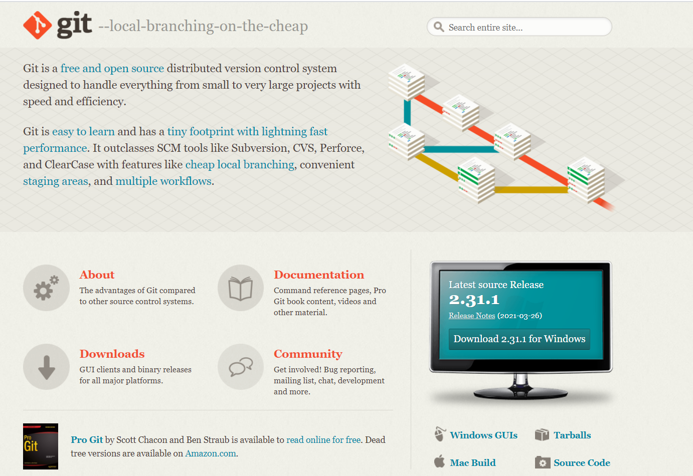

下载对应的版本即可安装！

安装：无脑下一步即可！安装完毕就可以使用了！

## 启动Git

安装成功后在开始菜单中会有Git项，菜单下有3个程序：任意文件夹下右键也可以看到对应的程序！

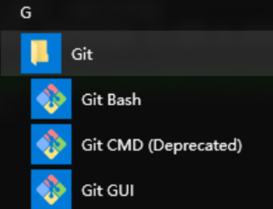

**Git Bash：**Unix与Linux风格的命令行，使用最多，推荐最多

**Git CMD：**Windows风格的命令行

**Git GUI**：图形界面的Git，不建议初学者使用，尽量先熟悉常用命令

## 常用的Linux命令

平时一定要多使用这些基础的命令！

1）、cd : 改变目录。

2）、cd . . 回退到上一个目录，直接cd进入默认目录

3）、pwd : 显示当前所在的目录路径。

4）、ls(ll):  都是列出当前目录中的所有文件，只不过ll(两个ll)列出的内容更为详细。

5）、touch : 新建一个文件 如 touch index.js 就会在当前目录下新建一个index.js文件。

6）、rm:  删除一个文件, rm index.js 就会把index.js文件删除。

7）、mkdir:  新建一个目录,就是新建一个文件夹。

8）、rm -r :  删除一个文件夹, rm -r src 删除src目录

```
rm -rf / 切勿在Linux中尝试！删除电脑中全部文件！
```

9）、mv 移动文件, mv index.html src index.html 是我们要移动的文件, src 是目标文件夹,当然, 这样写,必须保证文件和目标文件夹在同一目录下。

10）、reset 重新初始化终端/清屏。

11）、clear 清屏。

12）、history 查看命令历史。

13）、help 帮助。

14）、exit 退出。

15）、#表示注释

# Git配置

所有的配置文件，其实都保存在本地！

查看配置 git config -l

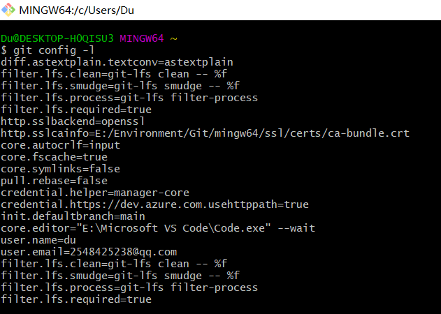

查看不同级别的配置文件：

```bash
#查看系统
configgit config --system --list　　
#查看当前用户（global）配置
git config --global  --list
```

**Git相关的配置文件：**

1）、E:\Environment\Git\etcgitconfig  ：Git 安装目录下的 gitconfig   --system 系统级

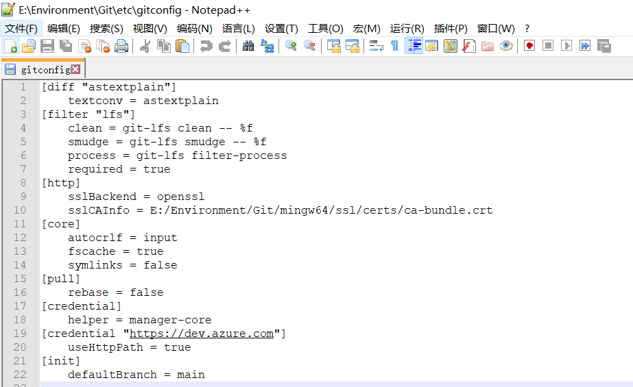

2）、C:\Users\Du\ .gitconfig   只适用于当前登录用户的配置  --global 全局

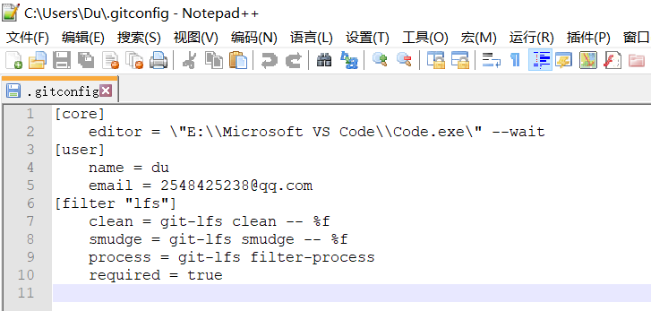

这里可以直接编辑配置文件，通过命令设置后会响应到这里。


## 设置用户名与邮箱（用户标识，必要）

当你安装Git后首先要做的事情是设置你的用户名称和e-mail地址。这是非常重要的，因为每次Git提交都会使用该信息。它被永远的嵌入到了你的提交中：

```bash
git config --global user.name "du"  #名称
git config --global user.email 2548425238@qq.com   #邮箱
```

只需要做一次这个设置，如果你传递了--global 选项，因为Git将总是会使用该信息来处理你在系统中所做的一切操作。如果你希望在一个特定的项目中使用不同的名称或e-mail地址，你可以在该项目中运行该命令而不要--global选项。总之--global为全局配置，不加为某个项目的特定配置。

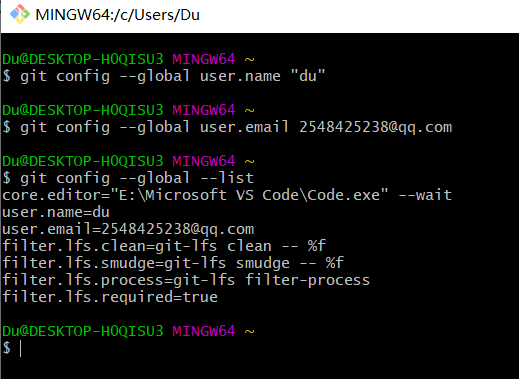


# Git基本理论（重要）

## 三个区域

Git本地有三个工作区域：工作目录（Working Directory）、暂存区(Stage/Index)、资源库(Repository或Git Directory)。如果在加上远程的git仓库(Remote Directory)就可以分为四个工作区域。文件在这四个区域之间的转换关系如下：

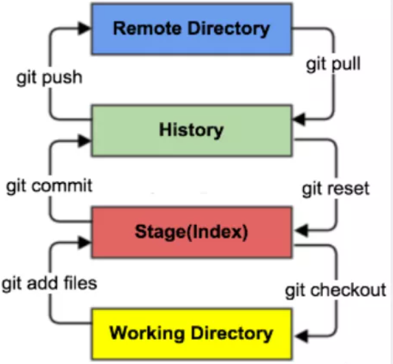

-   Workspace：工作区，就是你平时存放项目代码的地方
-   Index / Stage：暂存区，用于临时存放你的改动，事实上它只是一个文件，保存即将提交到文件列表信息
-   Repository：仓库区（或本地仓库），就是安全存放数据的位置，这里面有你提交到所有版本的数据。其中HEAD指向最新放入仓库的版本
-   Remote：远程仓库，托管代码的服务器，可以简单的认为是你项目组中的一台电脑用于远程数据交换

本地的三个区域确切的说应该是git仓库中HEAD指向的版本：

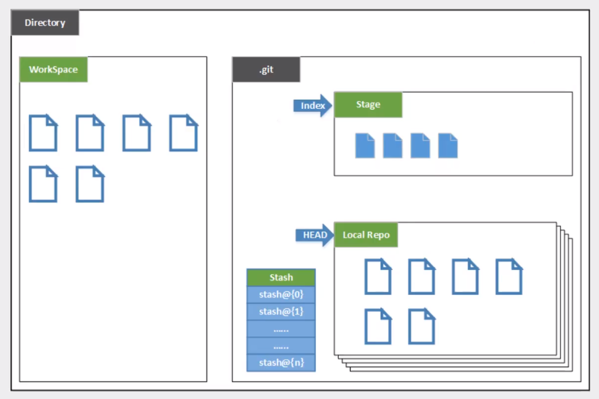

-   Directory：使用Git管理的一个目录，也就是一个仓库，包含我们的工作空间和Git的管理空间。
-   WorkSpace：需要通过Git进行版本控制的目录和文件，这些目录和文件组成了工作空间。
-   .git：存放Git管理信息的目录，初始化仓库的时候自动创建。
-   Index/Stage：暂存区，或者叫待提交更新区，在提交进入repo之前，我们可以把所有的更新放在暂存区。
-   Local Repo：本地仓库，一个存放在本地的版本库；HEAD会只是当前的开发分支（branch）。
-   Stash：隐藏，是一个工作状态保存栈，用于保存/恢复WorkSpace中的临时状态。

## 工作流程

git的工作流程一般是这样的：

１、在工作目录中添加、修改文件；

２、将需要进行版本管理的文件放入暂存区域；

３、将暂存区域的文件提交到git仓库。

因此，git管理的文件有三种状态：已修改（modified）,已暂存（staged）,已提交(committed)

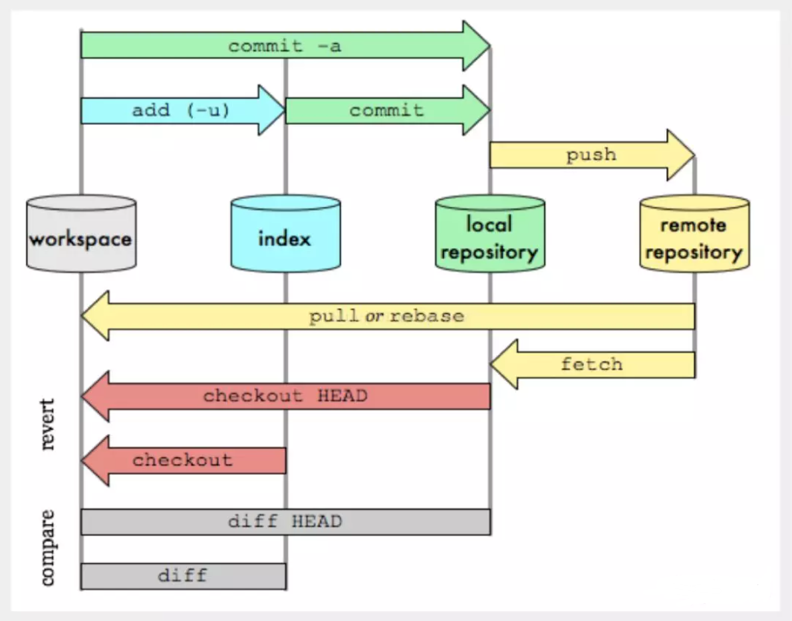


# Git项目搭建

## 创建工作目录与常用指令

工作目录（WorkSpace)一般就是你希望Git帮助你管理的文件夹，可以是你项目的目录，也可以是一个空目录，建议不要有中文。

日常使用只要记住下图6个命令：

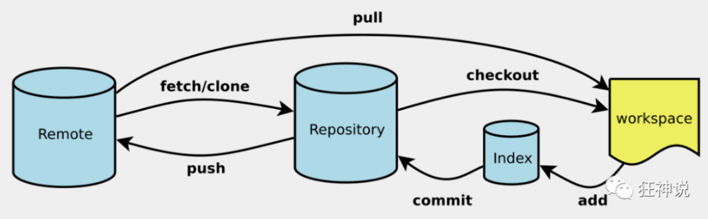

## 本地仓库搭建

创建本地仓库的方法有两种：一种是创建全新的仓库，另一种是克隆远程仓库。

1、创建全新的仓库，需要用GIT管理的项目的根目录执行：

```bash
# 在当前目录新建一个Git代码库
$ git init
```

2、执行后可以看到，仅仅在项目目录多出了一个.git目录，关于版本等的所有信息都在这个目录里面。

## 克隆远程仓库

1、另一种方式是克隆远程目录，由于是将远程服务器上的仓库完全镜像一份至本地！

```bash
# 克隆一个项目和它的整个代码历史(版本信息)
$ git clone [url]  # https://gitee.com/kuangstudy/openclass.git
```

2、去 gitee 或者 github 上克隆一个测试！

# Git文件操作

## 文件的四种状态

版本控制就是对文件的版本控制，要对文件进行修改、提交等操作，首先要知道文件当前在什么状态，不然可能会提交了现在还不想提交的文件，或者要提交的文件没提交上。

-   **Untracked**: 未跟踪, 此文件在文件夹中, 但并没有加入到git库, 不参与版本控制. 通过`git add` 状态变为`Staged`.
-   **Unmodify**: 文件已经入库, 未修改, 即版本库中的文件快照内容与文件夹中完全一致. 这种类型的文件有两种去处, 如果它被修改, 而变为`Modified`. 如果使用`git rm`移出版本库, 则成为`Untracked`文件
-   **Modified**: 文件已修改, 仅仅是修改, 并没有进行其他的操作. 这个文件也有两个去处, 通过`git add`可进入暂存`staged`状态, 使用`git checkout` 则丢弃修改过, 返回到`unmodify`状态, 这个`git checkout`即从库中取出文件, 覆盖当前修改 !
-   **Staged**: 暂存状态. 执行`git commit`则将修改同步到库中, 这时库中的文件和本地文件又变为一致, 文件为`Unmodify`状态. 执行`git reset HEAD filename`取消暂存, 文件状态为`Modified`

## 查看文件状态

上面说文件有4种状态，通过如下命令可以查看到文件的状态：

```bash
#查看指定文件状态
git status [filename]

#查看所有文件状态
git status

# git add .                  添加所有文件到暂存区
# git commit -m "消息内容"    提交暂存区中的内容到本地仓库 -m 提交信息
```

## 忽略文件

有些时候我们不想把某些文件纳入版本控制中，比如数据库文件，临时文件，设计文件等

在主目录下建立".gitignore"文件，此文件有如下规则：

1.  忽略文件中的空行或以井号（#）开始的行将会被忽略。
2.  可以使用Linux通配符。例如：星号（*）代表任意多个字符，问号（？）代表一个字符，方括号（[abc]）代表可选字符范围，大括号（{string1,string2,...}）代表可选的字符串等。
3.  如果名称的最前面有一个感叹号（!），表示例外规则，将不被忽略。
4.  如果名称的最前面是一个路径分隔符（/），表示要忽略的文件在此目录下，而子目录中的文件不忽略。
5.  如果名称的最后面是一个路径分隔符（/），表示要忽略的是此目录下该名称的子目录，而非文件（默认文件或目录都忽略）。

```bash
#为注释
*.txt        #忽略所有 .txt结尾的文件,这样的话上传就不会被选中！
!lib.txt     #但lib.txt除外
/temp        #仅忽略项目根目录下的TODO文件,不包括其它目录temp
build/       #忽略build/目录下的所有文件
doc/*.txt    #会忽略 doc/notes.txt 但不包括 doc/server/arch.txt
```

```gitignore
后端模板


*.class
*.log
*.lock

# Package Files #
*.jar
*.war
*.ear
target/

# idea
.idea/
*.iml

*velocity.log*

### STS ###
.apt_generated
.factorypath
.springBeans

### IntelliJ IDEA ###
*.iml
*.ipr
*.iws
.idea
.classpath
.project
.settings/
bin/

*.log
tmp/

#rebel
*rebel.xml*
```

```gitignore
vue模板


//.gitignore
 
.DS_Store
node_modules
/dist
 
# local env files
.env.local
.env.*.local
 
# Log files
npm-debug.log*
yarn-debug.log*
yarn-error.log*
 
# Editor directories and files
.idea
.vscode
*.suo
*.ntvs*
*.njsproj
*.sln
*.sw?
```

# 使用码云

>    github 是有墙的，比较慢，在国内的话，我们一般使用 gitee ，公司中有时候会搭建自己的gitlab服务器

这个其实可以作为大家未来找工作的一个重要信息！

1、注册登录码云，完善个人信息

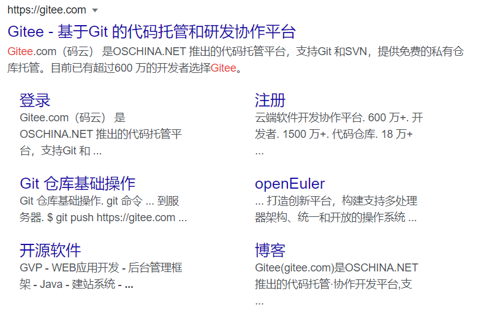

2、设置本机绑定SSH公钥，实现免密码登录！（免密码登录，这一步挺重要的，码云是远程仓库，我们是平时工作在本地仓库！)

```bash
# 进入 C:\Users\Du\.ssh 目录
# 生成公钥
ssh-keygen
```

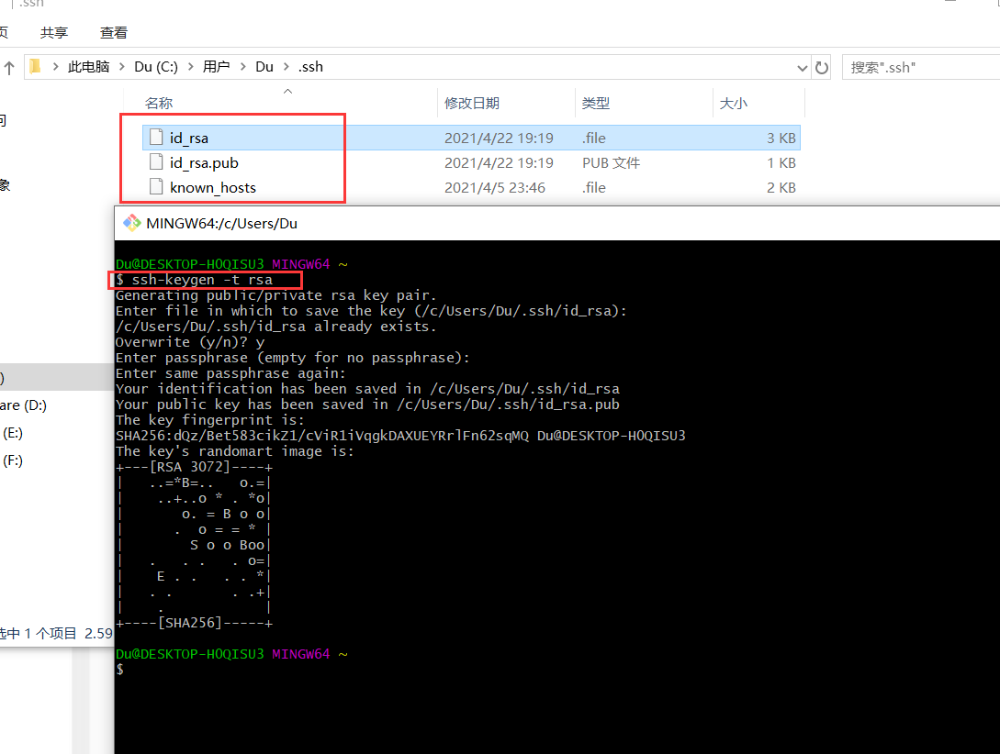

3、将公钥信息public key 添加到码云账户中即可！

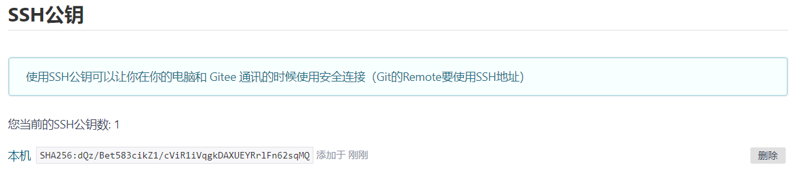

4、使用码云创建一个自己的仓库！

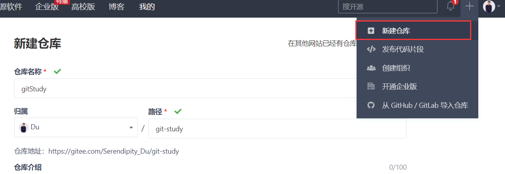

许可证：开源是否可以随意转载，开源但是不能商业使用，不能转载，...  限制！

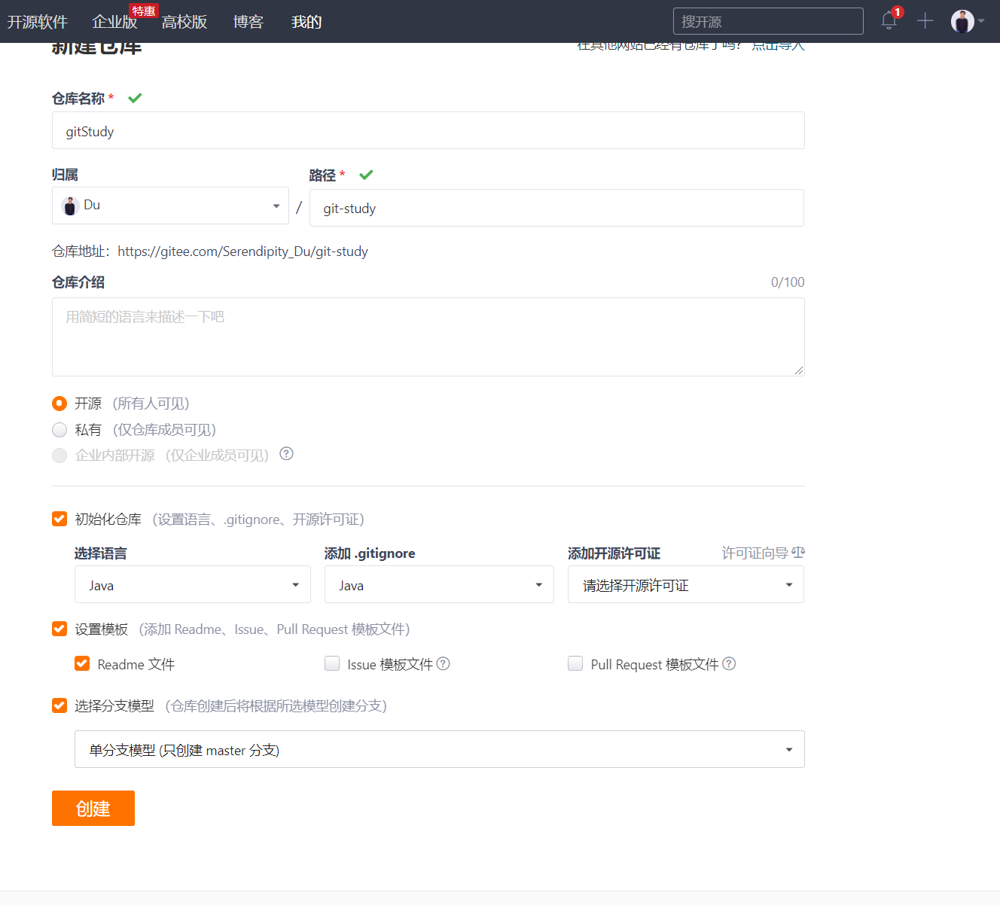

克隆到本地！

```bash
git clone [url]
```

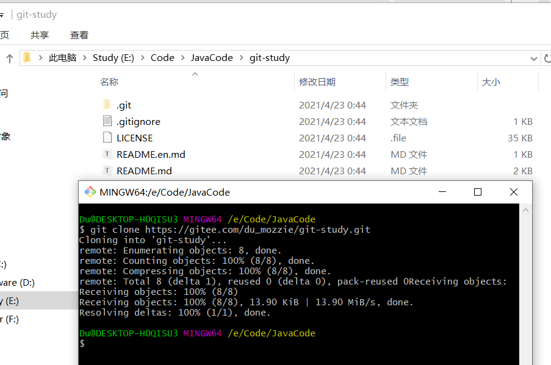


# IDEA中集成Git

1、新建项目，绑定git。

-   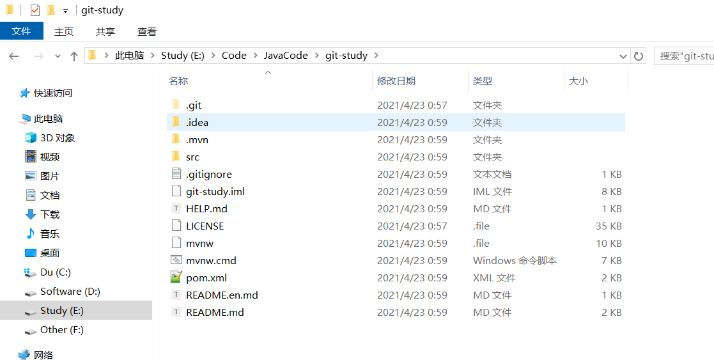

idea中集成Git操作

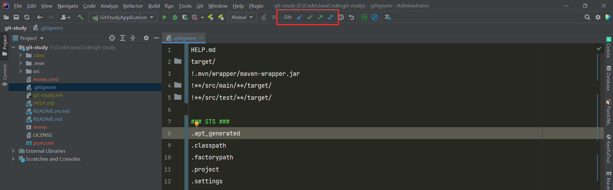

2、修改文件，使用IDEA操作git。

-   添加到暂存区
-   commit 提交
-   push到远程仓库

3、提交测试

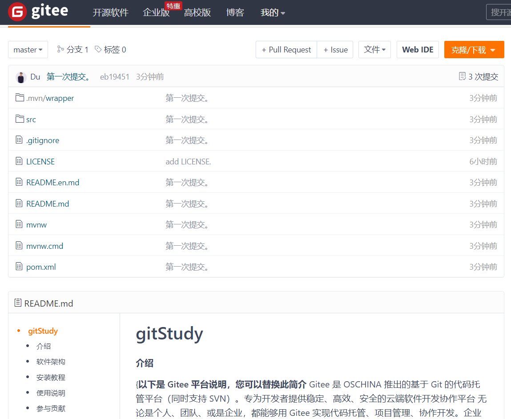

# 说明：GIT分支

分支在GIT中相对较难，分支就是科幻电影里面的平行宇宙，如果两个平行宇宙互不干扰，那对现在的你也没啥影响。不过，在某个时间点，两个平行宇宙合并了，我们就需要处理一些问题了！

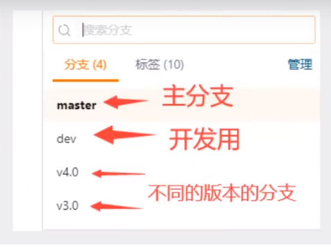

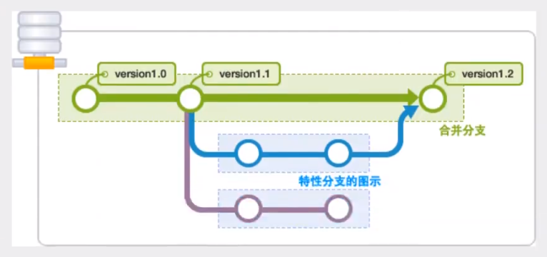

git分支中常用指令：

```bash
# 列出所有本地分支
git branch

# 列出所有远程分支
git branch -r

# 新建一个分支，但依然停留在当前分支
git branch [branch-name]

# 新建一个分支，并切换到该分支
git checkout -b [branch]

# 合并指定分支到当前分支
$ git merge [branch]

# 删除分支
$ git branch -d [branch-name]

# 删除远程分支
$ git push origin --delete [branch-name]
$ git branch -dr [remote/branch]
```

```bash
# 列出所有本地分支
git branch
# 列出所有远程分支
git branch -r
# 新建一个分支，但依然停留在当前分支
git branch [branch-name]
# 新建一个分支，并切换到该分支
git checkout -b [branch]
# 合并指定分支到当前分支
$ git merge [branch]
# 删除分支
$ git branch -d [branch-name]
# 删除远程分支
$ git push origin --delete [branch-name]$ git branch -dr [remote/branch]
```

IDEA中操作


如果多个分支并行执行，就会导致我们的代码不冲突，也就是同时存在多个版本

web-api	-A

web-admin -B	调用A

web-app -C	调用A和B

如果同一个文件在合并分支时都被修改了则会引起冲突：解决的办法是我们可以修改冲突文件后重新提交！选择要保留他的代码还是你的代码！

==master主分支应该非常稳定，用来发布新版本，一般情况下不允许在上面工作，工作一般情况下在新建的dev分支上工作，工作完后，比如上要发布，或者说dev分支代码稳定后可以合并到主分支master上来。==

```bash
# 合并指定分支到当前分支
$ git merge [branch]
```

# 常用命令

#### Git Flow

-   主干分支
-   稳定分支
-   开发分支
-   补丁分支
-   修改分支

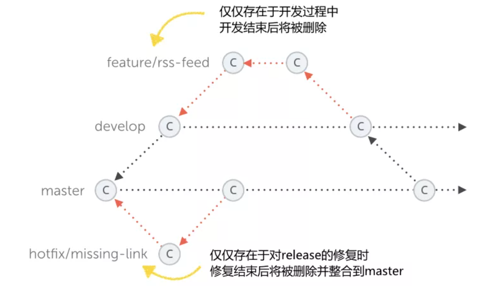

#### Github Flow

-   创建分支
-   添加提交
-   提交 PR 请求
-   讨论和评估代码
-   部署检测
-   合并代码

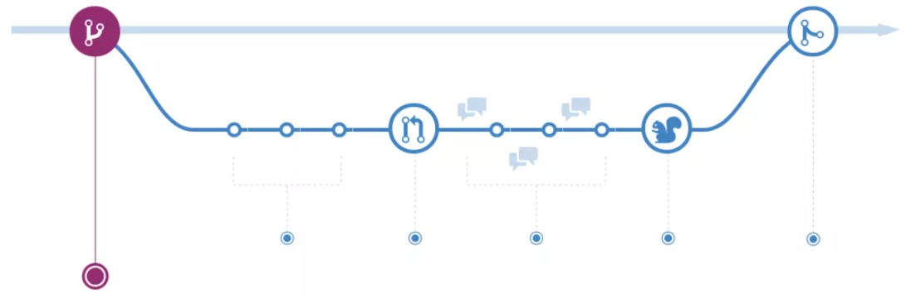

#### Gitlab Flow

-   带生产分支
-   带环境分支
-   带发布分支

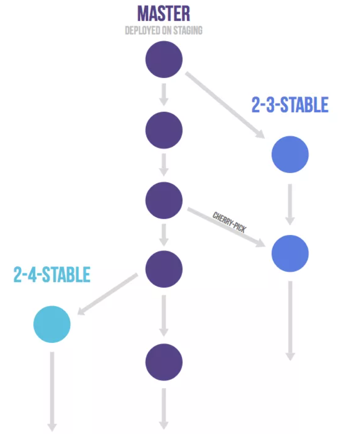

## 日常使用最佳实践

总结日常工作中应该遵循的 Git 使用方式和方法！

-   使用命令行代替图形化界面

-   -   使用命令行来操作，简洁且效率高

-   提交应该尽可能的表述提交修改内容

-   -   区分 subject 和 body 内容，使用空行隔开
    -   subject 一般不超过 50 个字符
    -   body 每一行的长度控制在 72 个字符
    -   subject 结尾不需要使用句号或者点号结尾
    -   body 用来详细解释此次提交具体做了什么

-   使用 .gitignore 文件来排除无用文件

-   -   可使用模板文件，然后根据项目实际进行修改

-   基于分支或 fork 的开发模式

-   -   不要直接在主干分支上面进行开发
    -   在新建的分支上进行功能的开发和问题的修复

-   使用 release 分支和 tag 标记进行版本管理

-   -   使用 release 分支发布代码和版本维护(release/1.32)
    -   使用 tag 来标记版本(A-大feature功能.B-小feature功能.C-只修bug)

## 常见企业工作流程

主要介绍，企业中常用的 Git 工作流程！

#### Git Flow

-   主干分支
-   稳定分支
-   开发分支
-   补丁分支
-   修改分支

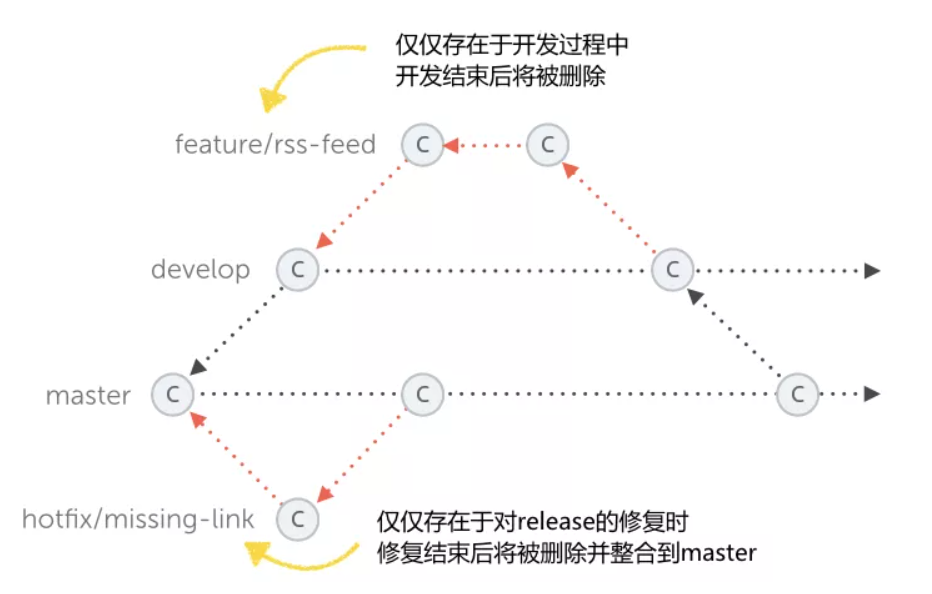

#### Github Flow

-   创建分支
-   添加提交
-   提交 PR 请求
-   讨论和评估代码
-   部署检测
-   合并代码

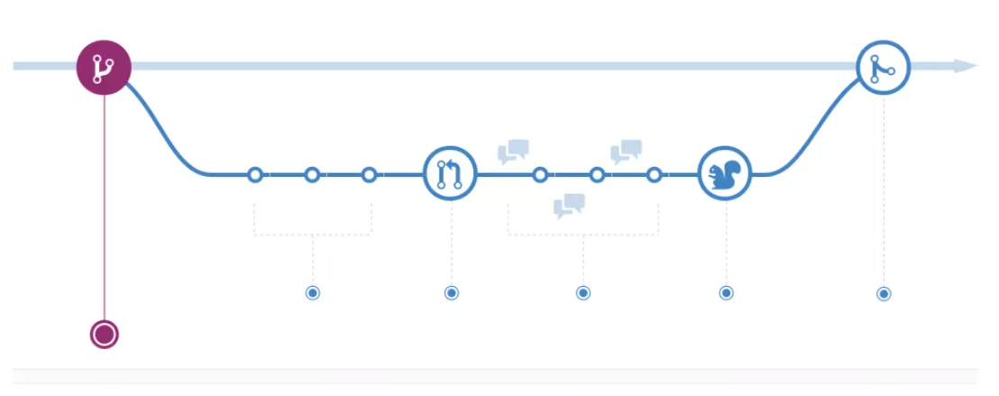

#### Gitlab Flow

-   带生产分支
-   带环境分支
-   带发布分支

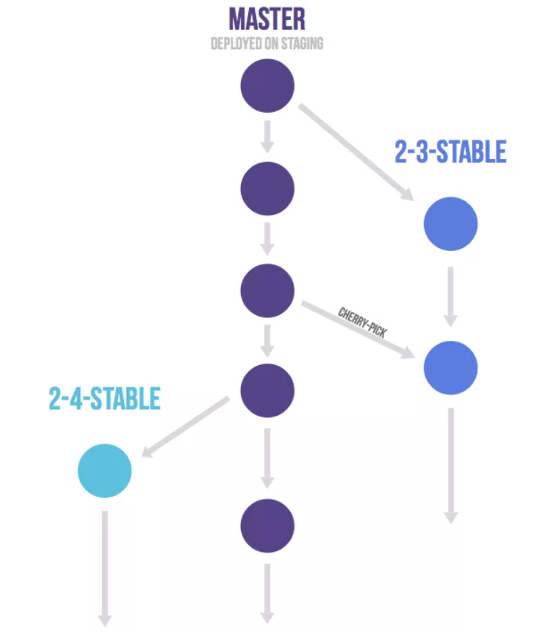

## 日常使用最佳实践

总结日常工作中应该遵循的 Git 使用方式和方法！

-   使用命令行代替图形化界面

-   -   使用命令行来操作，简洁且效率高

-   提交应该尽可能的表述提交修改内容

-   -   区分 subject 和 body 内容，使用空行隔开
    -   subject 一般不超过 50 个字符
    -   body 每一行的长度控制在 72 个字符
    -   subject 结尾不需要使用句号或者点号结尾
    -   body 用来详细解释此次提交具体做了什么

-   使用 .gitignore 文件来排除无用文件

-   -   可使用模板文件，然后根据项目实际进行修改

-   基于分支或 fork 的开发模式

-   -   不要直接在主干分支上面进行开发
    -   在新建的分支上进行功能的开发和问题的修复

-   使用 release 分支和 tag 标记进行版本管理

-   -   使用 release 分支发布代码和版本维护(release/1.32)
    -   使用 tag 来标记版本(A-大feature功能.B-小feature功能.C-只修bug)

## 常用命令汇总整理

日常使用只要记住 6 个命令就可以了。

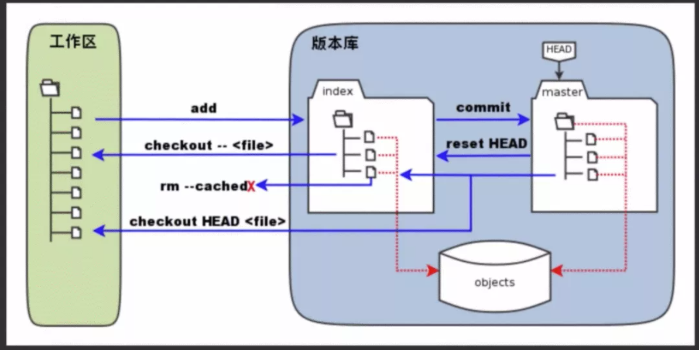

```bash
# 工作区 -> 暂存区$ git add <file/dir># 暂存区 -> 本地仓库$ git commit -m "some info"# 本地仓库 -> 远程仓库$ git push origin master # 本地master分支推送到远程origin仓库
# 工作区 <- 暂存区
$ git checkout -- <file>  # 暂存区文件内容覆盖工作区文件内容

# 暂存区 <- 本地仓库
$ git reset HEAD <file>   # 本地仓库文件内容覆盖暂存区文件内容

# 本地仓库 <- 远程仓库
$ git clone <git_url>        # 克隆远程仓库
$ git fetch upstream master  # 拉取远程代码到本地但不应用在当前分支
$ git pull upstream master   # 拉取远程代码到本地但应用在当前分支
$ git pull --rebase upstream master  # 如果平时使用rebase合并代码则加上
# 工作区 <- 本地仓库
$ git reset <commit>          # 本地仓库覆盖到工作区(保存回退文件内容修改)
$ git reset --mixed <commit>  # 本地仓库覆盖到工作区(保存回退文件内容修改)
$ git reset --soft <commit>   # 本地仓库覆盖到工作区(保留修改并加到暂存区)
$ git reset --hard <commit>   # 本地仓库覆盖到工作区(不保留修改直接删除掉)
```

## 配置实用参数选项

虽然配置比较简单，但是非常有用！

#### 全局配置

```bash
# 用户信息
$ git config --global user.name "your_name"
$ git config --global user.email "your_email"

# 文本编辑器
$ git config --global core.editor "nvim"

# 分页器
$ git config --global core.pager "more"

# 别名
$ git config --global alias.gs "git status"

# 纠错
$ git config --global help.autocorrect 1
```

#### 个人配置

```bash
# 不加--global参数的话，则为个人配置
$ git config --list
$ git config user.name
$ git config user.name "your_name"

# 如果在项目中设置，则保存在.git/config文件里面
$ cat .git/config
[user]
    name = "your_name"
......
```

## 合并和变基的选择

到底什么时候使用 merge 操作，什么时候使用 rebase 操作呢？

#### 使用 merge 操作 - Python 中的 Requests 库在使用

支持使用 merge 的开发者，他们认为仓库的提交历史就是记录实际发生过什么，它是针对于历史的一个文档，本身其实是有价值的，我们不应该随意修改。我们改变历史的话，就相当于使用“谎言”来掩盖实际发生过的事情，而这些痕迹是应该被保留的。可能，这样并不是很好。

在公众号后端架构师后台回复“架构整洁”，获取一份惊喜礼包。

```bash
# 3rd的两个分支的commit修改相同内容
*   62a322d - (HEAD->master) Merge branch 'hotfix3' into master
|\
| * 6fa8f4a - (hotfix3) 3rd commit in hotfix3
* | 548d681 - 3rd commit in master
|/
* 6ba4a08 - 2nd commit
* 22afcc1 - 1st commit
```

#### 使用 rebase 操作 - Python 中的 Django 库在使用

支持使用 rebase 的开发者，他们认为提交历史是项目过程中发生过的事情，需要项目的主干非常的干净。而使用 merge 操作会生成一个 merge 的 commit 对象，让提交历史多了一些非常多余的内容。

当我们后期，使用 log 命令参看提交历史的话，会发现主干的提交历史非常的尴尬。比如，同样的修改内容重复提交了两次，这显然是分支合并导致的问题。

```bash
# 3rd的两个分支的commit修改相同内容
* 697167e - (HEAD -> master, hotfix) 3rd commit
* 6ba4a08 - 2nd commit (2 minutes ago)
* 22afcc1 - 1st commit (3 minutes ago)
```

#### 两者的使用原则

总的原则就是，只对尚未推送或分享给其他人的本地修改执行变基操作清理历史，从不对已经推送到仓库的提交记录执行变基操作，这样，你才可能享受到两种方式带来的便利。

## 更新仓库提交历史

Git 提供了一些工具，可以帮助我们完善版本库中的提交内容，比如：

#### 合并多个 commit 提交记录

日常开发中，我们为了完成一个功能或者特性，提交很多个 commit 记录。但是在最后，提交 PR 之前，一般情况下，我们是应该整理下这些提交记录的。有些 commit 需要合并起来，或者需要将其删除掉，等等。

```bash
# 调整最近五次的提交记录
$ git rebase -i HEAD~5
$ git rebase -i 5af4zd35  # 往前第六次的commit值
reword c2aeb6e 3rd commit
squash 25a3122 4th commit
pick 5d36f1d 5th commit
fixup bd5d32f 6th commit
drop 581e96d 7th commit

# 查看提交历史记录
$ git log
* ce813eb - (HEAD -> master) 5th commit
* aa2f043 - 3rd commit -> modified
* 6c5418f - 2nd commit
* c8f7dea - 1st commit
```

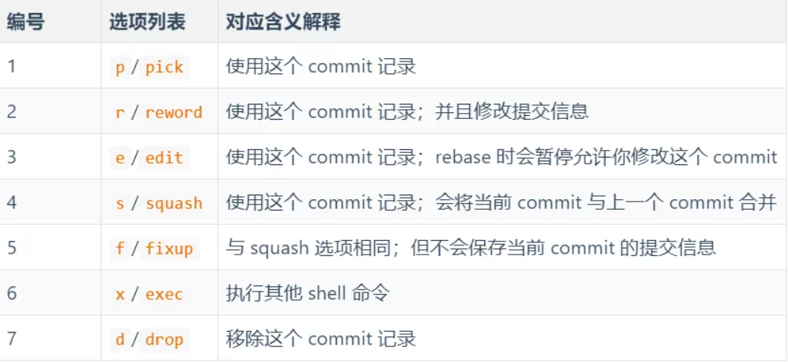

#### 删除意外调试的测试代码

有时候提交之后，我们才发现提交的历史记录中存在这一些问题，而这个时候我们又不想新生成一个 commit 记录，且达到一个修改的目录。即，修改之前的 commit 提交记录。

```bash
# 不使用分页器
$ git --no-pager log --oneline -1
d5e96d9 (HEAD -> master) say file

# 改变提交信息并加入暂存区
$ echo "hello" > say.txt
$ git add -u

# 改变当前最新一次提交记录
$ git commit --amend
# 改变且息不改变提交信
$ git commit --amend --no-edit
# 改变当前最新一次提交记录并修改信息
$ git commit --amend -m "some_info"

# 不使用分页器
$ git --no-pager log --oneline -1
9e1e0eb (HEAD -> master) say file
```

#### 取消多个 commit 中的部分提交

我们开发了一个功能，而在上线的时候，产品经理说这个功能的部分特性已经不需要了，即相关特性的提交记录和内容就可以忽略/删除掉了。

```bash
# 回滚操作(可多次执行回滚操作)
# 彻底上次提交记录；也可是PR的提交记录
# 默认会生成一个类型为reverts的新commit对象
$ git revert 3zj5sldl
[4] 合并某些特定的 commit 提交
我们不希望合并整个分支，而是需要合并该分支的某些提交记录就可以了。

bash
# 摘樱桃
$ git cherry-pick -x z562e23d
```

## 使用引用日志记录

如何找回我们丢失的内容和记录？


我们之前说过，使用下面命令回退内容、强制推送代码、删除本地分支，都是非常危险的操作，因为重置之后我们就没有办法在找到之前的修改内容了。

```bash
# 回退
$ git reset --hard <commit>

# 推送
$ git push origin master -f

# 分支
$ git branch -D <branch_name>
```

其实 Git 给我们留了一个后门，就是使用 relflog 命令来找回之前的内容，只不过是相对来说麻烦一些。而原理也很简答，就是在我们使用 Git 命令操作仓库的时候，Git 偷偷地帮助我们把所有的操作记录了下来。

```bash
# 查看日志记录
$ git --no-pager log --oneline -1
4bc8703 (HEAD -> master) hhhh

# 回退到上次提交
$ git reset --hard HEAD~1

# 查看引用日志记录
$ git reflog
6a89f1b (HEAD -> master) HEAD@{0}: reset: moving to HEAD~1
4bc8703 HEAD@{1}: commit (amend): hhhh

# 找回内容
$ git cherry-pick 4bc8703
```

## 批量修改历史提交

批量修改历史提交虽然不常用，但是理解的话可以省下很多时间！

之前我们学习到的命令都是针对于一个或者多个 commit 提交信息进行修改的，如果我们需要全局修改历史提交呢？当然，Git 中也是支持全局修改历史提交的，比如全局修改邮箱地址，或者将一个文件从全局历史中删除或修改。

-   开源项目中使用了公司邮箱进行提交了
-   提交文件中包含隐私性的密码相关信息
-   提交时将大文件提交到了仓库代码中了

这里我们可以使用 filter-brach 的方式进行修改，但是建议在使用之前，新建一个分支，在上面进行测试没有问题之后，再在主干上操作，防止出现问题，背个大锅在身上。

```bash
# 创建分支
$ git branch -b testing

# 修改邮箱地址
$ git filter-branch --commit-filter '
    if [ "$GIT_AUTHOR_EMAIL" == "escape@escapelife.site" ]; then
        GIT_AUTHOR_NAME="escape";
        GIT_AUTHOR_EMAIL="escape@gmail.com";
        git commit-tree "$@"
    else
        git commit-tree "$@"
  fi' HEAD
```

## 灵活使用钩子函数

主要介绍.git/hooks 目录下面的示例钩子函数！

在 Git 里面有两类，分别对应客户端和服务端钩子函数。客户端的钩子函数，是在执行提交和合并之类的操作时调用的。而服务端钩子函数，就是当服务端收到代码提交之后，可以出发代码检查和持续集成的步骤。作为开发者我们并不会搭建 Git 服务器，所以基本不会涉及。

下面就是 Git 自带的钩子脚本，但是自带的都以 .sample 作为后缀，表示并没有启用，表示为一个示例。如果需要启用的话，将 .sample 作为后缀删除掉，即可。而其钩子脚本的对应内容，都是使用 Shell 语法进行编写的。

```bash
➜ ll .git/hooks
total 112
-rwxr-xr-x  applypatch-msg.sample
-rwxr-xr-x  commit-msg.sample
-rwxr-xr-x  fsmonitor-watchman.sample
-rwxr-xr-x  post-update.sample
-rwxr-xr-x  pre-applypatch.sample
-rwxr-xr-x  pre-commit.sample
-rwxr-xr-x  pre-merge-commit.sample
-rwxr-xr-x  pre-push.sample  # 不会推送包含WIP的commit提交
-rwxr-xr-x  pre-rebase.sample
-rwxr-xr-x  pre-receive.sample
-rwxr-xr-x  prepare-commit-msg.sample
-rwxr-xr-x  update.sample
```

其实，钩子脚本使用任何语言编写都是可以的，只要你让程序返回对应的退出码就可以了。

正常的代码合入流程就是，我们本地修改之后，提一个 PR 请求并通过 Github 的 CI 检查，接下来进行代码评审，最后被合并入主干。但是，好的一个习惯就是，在代码提交之前就应该保证代码不会出现语法错误等基础问题，比如通过 flake8 和 PEP8 标准等。

这个时候我们就可以使用 pre-commit 这个 Github 的开源项目了，其本质就是给项目添加钩子函数的一个脚本，可以保证我们在提交代码或者推送代码之前，先检查代码的质量。

而 pre-commit-hooks 这个项目里面包含的就是，现在所支持的钩子脚本，即开箱即用的钩子脚本集合。而其钩子脚本的对应内容，都是使用 Python 语法进行编写的。

```bash
# 安装方式
$ pip install pre-commit

# 指定hook类型(即在哪里检查)
$ pre-commit install -f --hook-type pre-push

# 配置需要执行的检查
$ cat .pre-commit-config.yaml
repos:
- repo: https://github.com/pre-commit/pre-commit-hooks
  rev: v2.9.2
  hooks:
    - id: trailing-whitespace
    - id: flake8

# 执行push操作时检查
$ git push origin master
```

## 快速克隆大型项目

在大项目中工作中，拉取代码非常占时间！

我们如果想为 Linux 或 Python 这样的大型项目贡献提交的时候，首先遇到的问题就是，如果快速的 clone 该项目到本地。因为改项目提交历史超多且仓库巨大，加了国内网络的问题，可能等项目完全拉下来的时候，我们的热情都消减下去了。

好在 Git 也帮我们想到了这样的问题，我们可以使用 --depth 参数值拉取远程仓库上面最新一次的提交历史，并不包含项目历史记录，即 .git/objects/ 目录下的对象只是本地的，并不包含之前的多次修改产生的对象。

```bash
# 克隆不包含之前历史
$ git clone http://xxx.xx.xxx/xxx --depth=1
但是，有时间我们可能会需要 clone 仓库中的某个 tag 版本对应下的内容。如果我们直接使用 clone 命令是无法做到的，需要执行如下操作，即可完美解决。
# 克隆特定版本代码
$ git init xxx-15-0-1
$ git remote add origin http://xxx.xx.xxx/xxx
$ git -c protocol.version=2 fetch origin 15.0.1 --depth=1
$ git checkout FETCH_HEAD
```

上面的效果已经基本可以满足我们日常使用需求了，但是不幸的是，你现在接受了一个机器学习的项目，里面包含了大量的 lfs 文件，现在 clone 又会变得非常慢。可以使用如下操作来避免，Git 工具主动拉去 lfs 文件，来达到目录。

```bash
# 克隆不包含LFS数据
$ GIT_LFS_SKIP_SMUDGE=1 git clone http://xxx.xx.xxx/xxx
```

## 如何处理工作中断

如果在多路运转的时候，还能够高效的进行开发！

比如，我们现在正在一个分支为项目添加一个小的功能，此时，产品经理找到你说是线上环境现在有一个 bug 需要让你来修复下。但是，此时我们添加的小功能并没有完成。

如果此时，我们直接切换到主干分支的话，会将之前分支没有来得及提交的内容全部都带到了主干分支上来，这是我们不想看到的情况。此时，我们需要保存上个分支的工作状态，在我们修改完成线上 bug 之后，再继续工作。

好在 Git 也帮我们想到了这样的问题，我们可以使用 stash 子命令帮助我们将当前工作区、暂存区当中的修改都保存到堆栈之中。等到需要处理的时候，再弹出堆栈中的内容，我们再次进行开发。

```bash
➜ git stash -h
usage: git stash list [<options>]
   or: git stash show [<options>] [<stash>]
   or: git stash drop [-q|--quiet] [<stash>]
   or: git stash ( pop | apply ) [--index] [-q|--quiet] [<stash>]
   or: git stash branch <branchname> [<stash>]
   or: git stash clear
   or: git stash [push [-p|--patch] [-k|--[no-]keep-index] [-q|--quiet]
          [-u|--include-untracked] [-a|--all] [-m|--message <message>]
          [--pathspec-from-file=<file> [--pathspec-file-nul]]
          [--] [<pathspec>...]]
   or: git stash save [-p|--patch] [-k|--[no-]keep-index] [-q|--quiet]
          [-u|--include-untracked] [-a|--all] [<message>]
# 存储当前的修改但不用提交commit
$ git stash

# 保存当前状态包括untracked的文件
$ git stash -u

# 展示所有stashes信息
$ git stash list

# 回到某个stash状态
$ git stash apply <stash@{n}>

# 删除储藏区
$ git stash drop <stash@{n}>

# 回到最后一个stash的状态并删除这个stash信息
$ git stash pop

# 删除所有的stash信息
$ git stash clear

# 从stash中拿出某个文件的修改
$ git checkout <stash@{n}> -- <file-path>
```

其实比较保险的做法就是，将当前的所有修改进行 push 并保存到远程仓库里面。这样的好处在于，可以远端备份我们的修改，不会害怕本地文件丢失等问题。等到我们需要继续开发的时候，拉下对应内容，再想办法进行补救，比如使用 --amend 或者 reset 命令。

```bash
# 将工作区和暂存区覆盖最近一次提交
$ git commit --amend
$ git commit --amend -m "some_info"

# 回退到指定版本并记录修改内容(--mixed)
# 本地仓库覆盖到工作区(保存回退文件内容修改)
$ git reset a87f328
$ git reset HEAD~
$ git reset HEAD~2
$ git reset <tag>~2
$ git reset --mixed <commit/reference>

# 本地仓库覆盖到工作区(不保留修改直接删除掉)
$ git reset --soft <commit/reference>
# 本地仓库覆盖到工作区(保留修改并加到暂存区)
$ git reset --hard <commit/reference>
```
